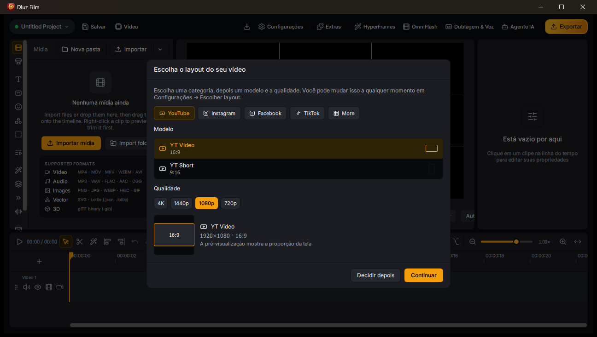

  

<h1 align="center">Dluz Film v2.0</h1>

  <strong>Editor de vídeo profissional para desktop com inteligência artificial integrada, aceleração por hardware e interface ultra moderna.</strong>

  
  
  
  
  

  <a href="https://github.com/dluzgames/DluzFilm">Repositório Oficial</a> ·
  <a href="https://github.com/dluzgames/DluzFilm/releases/latest">Download</a> ·
  <a href="https://github.com/dluzgames/DluzFilm/issues">Suporte & Sugestões</a> ·
  <a href="https://dluzgames.com.br">DLuz Games</a>

---

## 📸 Interface

  

<em>Dluz Film v2.0: Cards cinzas em ardósia, divisórias obsidianas de alto contraste, cantos arredondados (radius 8px) e timeline de precisão.</em>

---

## ⚡ Destaques do Dluz Film v2.0

### 🎨 1. Nova Identidade Visual & UX Intuitiva
- **Cards Cinza Ardósia (`#1c1d22`):** Superfícies visualmente destacadas para organizar a navegação (Mídia, Timeline, Preview, Painel de Propriedades e Modais).
- **Divisórias Obsidianas (`#090a0d` / `#121316`):** Linhas de corte limpas que criam separação clara entre as ferramentas sem poluir o olhar.
- **Cantos Arredondados Modernos (`8px`):** Estilo refinado em todos os painéis e caixas de ferramentas.
- **Acentos Dourados/Âmbar (`#f59e0b` / `#fbbf24`):** Cores de ação rápida, sliders visíveis e botão de **Exportar** em destaque.

### 🧠 2. Inteligência Artificial Integrada (OmniRouter & MCP)
- **OmniRouter Multiprovedor:** Conexão nativa e protegida com Gemini 2.5 Flash, OpenCode e modelos neurais locais via 9Router.
- **Quatro Agentes de Produção Especializados:**
  - 📝 **Roteirista:** Criação e estruturação automática de roteiros de alta retenção.
  - ✂️ **Diretor de Cortes:** Detecção de cenas, pausas e edição da timeline guiada pelo texto falado.
  - 🎨 **HyperFrames:** Geração e injeção automática de cartelas animadas com auto chroma key.
  - 🎵 **Diretor de Áudio:** Sincronia de trilhas sonoras adaptativas e efeitos sonoros (SFX) contextuais.
- **Servidor MCP Desacoplado:** Serviço em segundo plano dedicado (`dluzfilm_mcp.exe`) que permite automação completa por agentes externos (Antigravity, Cursor, Claude Code) sem travar a interface do usuário.

### 🚀 3. Alta Performance & GPU Acceleration
- **Direct3D 11 Zero-Copy (Windows):** Os frames decodificados em GPU trafegam diretamente para a textura de renderização da VRAM, eliminando engasgos e cópias redundantes entre RAM e CPU.
- **Renderização por Hardware (NVENC):** Exportação ultra rápida em H.264/HEVC com aceleração dedicada nas placas NVIDIA GeForce (RTX 2060 e superiores).
- **Encerramento Limpo Instantâneo:** Sem processos zumbis ou resíduos no Gerenciador de Tarefas ao fechar o editor.

### ✂️ 4. Linha do Tempo Precisa & Edição Sem Restrições
- **Fim do Bug do Overlap:** O algoritmo de timeline respeita o corte cirúrgico; arrastar ou remover clipes não cria mais transições (crossfades) indesejadas nem empurra clipes vizinhos.
- **Navegação Quadro a Quadro (`Shift + Setas`):** Deslocamento cirúrgico de exatamente 1 frame por clique para cortes de precisão milimétrica.
- **Lossless Rotation (Rotação Sem Perda):** Rotação instantânea de vídeos (90°, 180°, 270°) direto na Bin de Mídia ou na Timeline sem re-encodificação nem perda de qualidade.
- **Salvar Como (`Save As`):** Duplicação ágil de projetos para criar versões adaptadas (Shorts, Reels, TikTok) a partir do corte original.

### 🎙️ 5. Voz Clonada DLuz (OmniVoice CUDA)
- Síntese neural acelerada na GPU local (RTX 2060) com a voz clonada do criador DLuz, operando no padrão oficial de fala acelerada (`speed=1.15`), sem cortes no final das frases e mixagem calibrada para presença máxima de estúdio.

---

## 📥 Instalação e Uso

### Windows (10 / 11 x64)
1. Acesse a aba de [Releases](https://github.com/dluzgames/DluzFilm/releases/latest).
2. Baixe o pacote executável `Dluz Film.exe`.
3. Execute o aplicativo diretamente e comece a editar.

---

## 🛠️ Documentação Técnica

Para desenvolvedores e colaboradores do ecossistema DLuz Games:
- Arquitetura completa, mapa de diretórios e contratos de IA: consulte [project.md](project.md).
- Protocolo de integração MCP: consulte `docs/MCP.md`.
- Efeitos visuais e shaders GPU: consulte `docs/gpu-effects.md`.

---

## 🤝 Créditos & Observação de Fork

> **Nota:** O **Dluz Film** é um projeto autônomo mantido e distribuído pela **DLuz Games**.  
> O software foi desenvolvido a partir de um fork do [Drift](https://github.com/CutWire-Studios/Drift) (criado pela CutWire Studios sob a licença [GPL-3.0](LICENSE)), ao qual foram adicionadas camadas exclusivas de inteligência artificial (OmniRouter, HyperFrames, OmniVoice CUDA), identidade visual personalizada e otimizações proprietárias de pipeline para edição de alta performance.

---

## 📄 Licença

Distribuído sob a licença **GNU General Public License v3.0 (GPL-3.0)**. Consulte [LICENSE](LICENSE) para mais informações.
